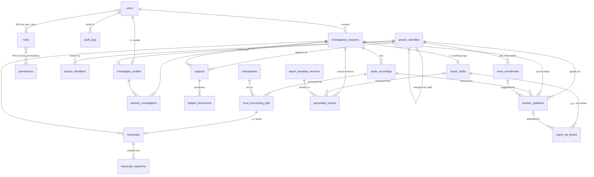
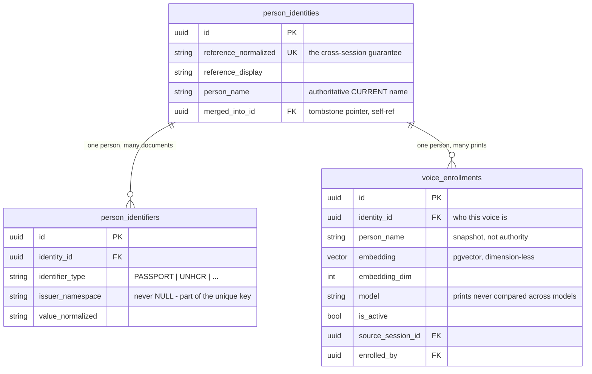
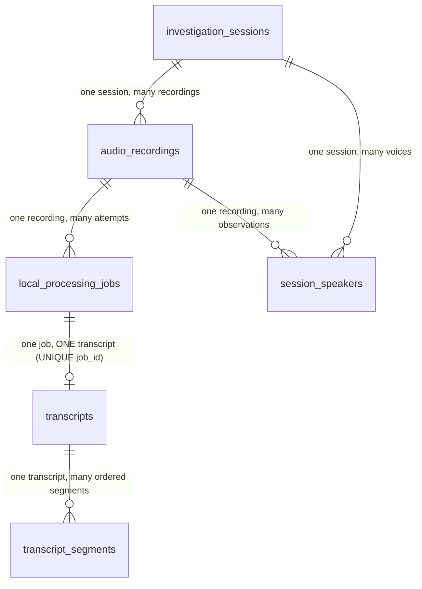

# Database relationships — the ER model, explained

> **Updated identity model:** Person reference numbers have been removed. People now use internal UUIDs. See [the current identity contract and migration](person-identity-migration.md). Reference-number descriptions below document the earlier implementation.

**Who this is for:** developers and database administrators.

PostgreSQL 16 (+ pgvector). Twenty-two tables, every one keyed by a UUID surrogate primary
key (`id`), most carrying `created_at` / `updated_at`. This document reads the schema the
way a database designer would: **who owns whom, with what cardinality, and why**.

The single most important design fact: **`person_identities` is the hub of the model.**
Everything that claims "this row is about that human" — a subject in a session, a speaker
in a recording, a voice print, an investigator profile — points *at* the registry with a
`identity_id` foreign key. No table ever points the other way. That is what lets many
observations across many sessions converge on one person without ever duplicating the
person.

---

## 1. The full picture (UML / crow's foot)

Reading the symbols: `||` exactly one · `|o` zero or one · `o{` zero or many. So
`person_identities ||--o{ voice_enrollments` reads **"one person has zero-to-many voice
prints; every print belongs to at most one person."**

---

## 2. One-to-one relationships

There are exactly three, and each is enforced by a `UNIQUE` on the foreign key — that is
what turns a one-to-many into a one-to-one at the database level, not documentation.

| Relationship | Enforced by | Why it is 1:1 and not one table |
|---|---|---|
| **One user has at most one investigator profile** (`investigator_profiles.user_id` → `users.id`, UNIQUE) | `UNIQUE(user_id)` | Login identity (username, password hash, active flag) and HR identity (rank, unit, phone, الجهاز, الرقم العسكري) change for different reasons and are read by different features. Splitting them keeps `users` small and hot, and lets the profile CASCADE away with its user while `created_by` references stay `SET NULL`. |
| **One processing job produces at most one transcript** (`transcripts.job_id` → `local_processing_jobs.id`, UNIQUE) | `UNIQUE(job_id)` | The unique key is the **idempotency guarantee**: a workstation that submits the same finished job twice (network retry) cannot create a second transcript. The transcript row is the *result*; the job row is the *authorization and lifecycle* — they exist at different times, so they are different rows. |
| **One session has at most one report draft** (`report_drafts.session_id`, UNIQUE) | `UNIQUE(session_id)` | The draft is the session's single working محضر. Issuing it does not create a second one: the draft goes FINAL, and a correction reopens *the same* draft to produce the next version. |

A third, softer one: **one investigator profile points at most at one canonical person**
(`investigator_profiles.identity_id`, nullable). It is 0..1 rather than 1:1 because a
profile missing الجهاز or الرقم العسكري cannot derive a reference and therefore has no
registry row *yet* — the FK is filled the first time they are assigned to a session.

---

## 3. One-to-many relationships (the backbone)

Stated the way the data means it:

### The person registry (hub)

* **One person has many voice prints** (`voice_enrollments.identity_id`). Deliberately
  many: different microphones and rooms give different embeddings, and the matcher scores
  a person by their *best* print, so prints reinforce rather than compete. The فحص
  البصمات الصوتية action exists precisely because "many prints" must still be *one voice*.
* **One person has many external identifiers** (`person_identifiers.identity_id`) — a
  passport, a residency permit, an UNHCR card. `UNIQUE(identifier_type, issuer_namespace,
  value_normalized)` is what makes automatic identity resolution safe: passport 1234567
  exists in many countries, so the namespace is part of the key.
* **One person appears as many subjects** (`subjects.identity_id`) — one row **per session
  they were interviewed in**. The subject row is that session's *snapshot* of the person
  (name as recorded that day, documents presented that day); the registry row is the
  *authority*.
* **One person speaks as many session speakers** (`session_speakers.identity_id`) — one
  row per (session, voice) they were identified as.
* **One person record can absorb many merged duplicates** — see self-references below.

### The report (derived, never evidence)

* **One draft has many Q&A blocks** (`report_qa_blocks.draft_id`, CASCADE) — with
  `UNIQUE(draft_id, sequence)` keeping a dense printed order. Each block **copies** the
  transcript text it came from rather than referencing it, which is what makes an issued
  report immune to a later correction.
* **One session has many issued reports** (`generated_reports.session_id`) — with
  `UNIQUE(session_id, report_version)`: versions never collide and are never overwritten.
* **One template version prints many reports** (`generated_reports.template_version_id`,
  **RESTRICT**) — a layout cited by an issued document can never be deleted.
* **Many Q&A blocks are attributed to one speaker observation**
  (`report_qa_blocks.question_speaker_id` / `answer_speaker_id`, **SET NULL**) — the link is
  soft on purpose: deleting a speaker row must never cascade into an issued report's history.

### Sessions own their world

`investigation_sessions` is the aggregate root of the operational domain. Five child
tables carry `session_id ... ON DELETE CASCADE`; deleting a session deletes its whole
subtree, and nothing else:

* **One session has many subjects** — with `UNIQUE(session_id, participant_key)`
  (DEFERRABLE, because a save rebuilds subject rows delete-then-insert in one
  transaction). `participant_key` identifies a *participation slot* across those rebuilds;
  it is **not** a person identifier and never crosses a session boundary.
* **One session has many recordings** (`audio_recordings.session_id`) — an interview is
  frequently captured in several audio files.
* **One session has many speakers** (`session_speakers.session_id`) — with
  `UNIQUE(session_id, speaker_label)`: within one session, `SPEAKER_03` names exactly one
  voice.
* **One session has many processing jobs and many transcripts** — one job (and on success
  one transcript) *per recording per attempt*.
* **One session has many assigned investigators** — via the junction table (see M:N).

### Recordings and their derivatives

* **One recording has many processing jobs** (`local_processing_jobs.recording_id`) —
  reprocessing is a new job; failed attempts are history, not overwrites.
* **One recording has many speaker observations** (`session_speakers.recording_id`) — one
  per diarized voice *in that audio file*. The partial unique index
  `(session_id, recording_id, source_label)` is the fix for the identity-leak bug: a
  diarizer's `SPEAKER_00` is a cluster index local to one file, so recording B's
  `SPEAKER_00` must be a **different row** than recording A's until a human or biometrics
  says otherwise.
* **One transcript has many segments** (`transcript_segments.transcript_id`) — with
  `UNIQUE(transcript_id, sequence)` guaranteeing a stable reading order. Segments keep
  `original_text` (AI output, never overwritten) beside `edited_text` (human correction) —
  an audit requirement expressed as columns, not as an UPDATE.

### Subjects and evidence

* **One subject presented many documents** (`subject_documents.subject_id`) — 0..n scans;
  the file lives on disk, the row keeps its SHA-256 and provenance.

### Suggestions

* **One voice print backs many suggestions** (`session_speakers.suggested_enrollment_id`,
  `SET NULL`) — the print that produced a suggestion is recorded so the transcript stays
  auditable years later; deleting the print keeps the decision but clears the live link.

### Actor trails (users as the "many" side's parent)

`created_by` / `requested_by` / `enrolled_by` / `edited_by` / `decided_by` /
`uploaded_by` / `registered_by` / `audit_logs.user_id` all point at `users`. Two delete
policies, chosen per column:

* `ON DELETE RESTRICT` where the record is *operationally owned* by the actor
  (`investigation_sessions.created_by`, `audio_recordings.created_by`,
  `local_processing_jobs.requested_by`): you may not delete a user who owns live case
  material.
* `ON DELETE SET NULL` where the reference is *historical attribution* (audit rows,
  transcript edits, enrolments): history survives the account.

---

## 4. Many-to-many relationships

All three are materialized as junction tables — never as arrays or JSON — because the
pairs need their own constraints and, in one case, their own attributes:

| M:N | Junction | Extra attributes | Key |
|---|---|---|---|
| **Many users hold many roles** | `user_roles` | — | composite PK (`user_id`, `role_id`), both CASCADE |
| **Many roles grant many permissions** | `role_permissions` | — | composite PK, both CASCADE |
| **Many investigators are assigned to many sessions** | `session_investigators` | `assignment_role` (LEAD / ASSISTANT) | `UNIQUE(session_id, investigator_id)` |

`session_investigators` is the textbook case for *why junctions beat arrays*: the
assignment itself carries data (who leads), needs uniqueness (assigned once per session),
and cascades correctly from both ends.

There is also an **implicit** many-to-many worth naming: *many persons appear in many
sessions*, realized through `subjects` and `session_speakers` rather than a bare junction
— because an appearance is not a bare pair; it carries the snapshot (name, documents,
role, suggestion state) that a plain junction could not.

---

## 5. Self-referencing relationships

| Relationship | Meaning |
|---|---|
| `users.created_by` → `users.id` (`SET NULL`) | **One user creates many users** — the admin provisioning chain. |
| `person_identities.merged_into_id` → `person_identities.id` (`SET NULL`) | **One surviving person absorbs many merged duplicates.** Merged rows are tombstones, not deletions: the retained `UNIQUE(reference_normalized)` on the dead row is exactly what stops a stale client from re-creating a reference that was merged away. Reads follow the pointer to the survivor (`resolve_identity`). |

---

## 6. Deliberate *non*-relationships (logical links without FKs)

Three places intentionally have **no** foreign key, and each has a reason — knowing them
prevents "fixing" them into bugs:

* **`transcript_segments.speaker_label` → `session_speakers.speaker_label`** is a logical
  join on `(session_id, speaker_label)`, not an FK. Segments arrive from the workstation
  as text under a label; the speaker row is resolved server-side. The composite uniqueness
  on `session_speakers` makes the join exact. (This is the join that answers "give me
  everything علي عباس said, across all recordings": segments → speaker label → speaker row
  → `identity_id`.)
* **`voice_enrollments.person_name` / `person_reference`** duplicate registry fields *on
  purpose*: they are the **enrolment-time snapshot** (what was recorded the day the print
  was taken), kept for the audit trail. The authoritative current name lives one FK away
  in `person_identities`. Editing the snapshot consolidates nothing — matching groups by
  `identity_id`.
* **`session_speakers.voice_embedding`** stores the probe embedding on the observation row
  itself (JSONB) rather than referencing a vector table — it belongs to that one
  observation, is never shared, and exists so a later enrolment can re-match old sessions
  without reprocessing audio.

---

## 7. Domain diagrams with attributes that matter

### Identity & biometrics

### Session → recording → job → transcript → segments

The chain is strictly downstream: sessions never know about transcripts except through
their children, and every table in the chain CASCADEs from its parent — delete a
recording and its jobs, transcript, segments and observations go with it, while the
person registry and voice prints (which live *outside* the session subtree) are untouched.

---

## 8. Normalization stance

The schema is **3NF with two audited denormalizations**:

* Every non-key attribute depends on its row's key (no repeating groups, no partial
  dependencies on the composite junctions, no transitive dependencies — person facts live
  on the person, session facts on the session).
* Denormalization #1: **snapshot name/reference on `voice_enrollments`** (and
  `subjects.subject_name`, `session_speakers.display_name`). These are *historical facts*
  ("what we recorded that day"), not cached copies — updating them retroactively would
  falsify the record, so their "staleness" is the feature.
* Denormalization #2: **model metadata on `transcripts` and `workstations`**
  (provider/model/revision columns). A workstation upgrades over time; the transcript must
  keep the versions that actually produced it.

Everything else that looks duplicated resolves through the hub: names shown anywhere in
the interface come from `person_identities.person_name` via `identity_id` — one source of
truth, many observers.
